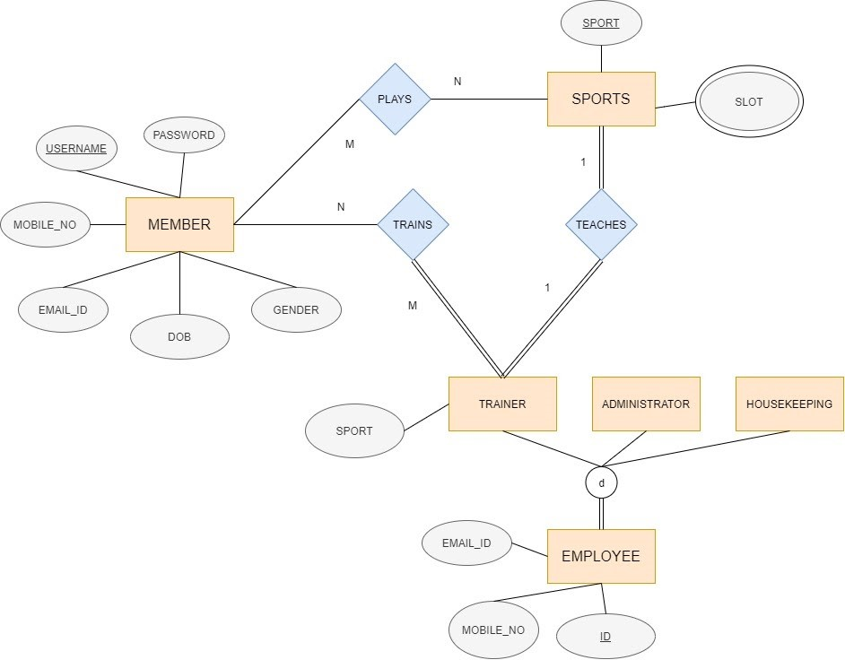

# AthElite Sports Complex 🏀

**Live Demo** : http://athelite-static.herokuapp.com/

## Abstract
The aim of the project is to create a website using database management system for a sports complex called **AthElite Sports Complex**. This website can store member details and allow them to take admission in the sports they are interested in. The members can view different types of membership plans and the facilities being provided by the Sports Complex. They can also contact trainers of respective sports for any queries.

## ER Diagram

	

## Implementation Details

The website makes use of PHP as a server-side scripting language.  MySQLi extension of php has been used to interact with the database. It has also been used to make the website dynamic.

MySQL has been used to implement the database. MySQL queries and the phpMyadmin interface by XAMPP were used to create the database.

We made use of the Apache, MySQL and PHP stack provided by XAMPP. XAMPP helps to host the website locally.

For the Front-End, HTML, CSS and JavaScript were used. HTML was used for the basic structure of the website. JavaScript was used to do some animations. CSS was used to style the website, to make it look more interactive and easier to use. 
